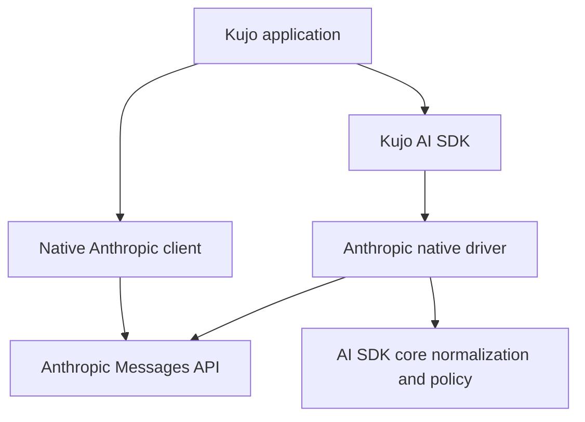

# Anthropic Implementation Report

## Executive Summary

The early Anthropic package adds a native Messages API client and a native Kujo AI SDK provider driver. It intentionally keeps Anthropic-specific content blocks, headers, SSE events, thinking, tools, and usage native while exposing normalized chat and stream behavior through AI SDK core.

## Official API Evidence

Official Anthropic Messages API documentation and official Python/TypeScript SDK repositories were inspected on 2026-08-26. Verified `https://api.anthropic.com/v1/messages`, `x-api-key`, `anthropic-version`, `ANTHROPIC_API_KEY`, Messages `system`, content blocks, tool definitions/tool use, `output_config`, thinking, prompt-cache metadata, count-tokens endpoint, SSE stream event taxonomy, usage, request IDs, and provider error payloads. Current model IDs remain environment-selected rather than hard-coded.

## Architecture

## Native API Coverage

| Capability | Implemented | Offline Tested | Live Tested | Notes |
|---|---:|---:|---:|---|
| Messages | yes | yes | skipped | Native content blocks retained. |
| Streaming | yes | yes | skipped | Anthropic SSE events, not OpenAI or Ollama framing. |
| Tools/tool use | yes | yes | skipped | Native `input_schema`, `tool_use`, and normalized tool calls. |
| Thinking | request passthrough | fixture shape | skipped | Model/API capability dependent. |
| Structured output | request passthrough | fixture shape | skipped | Uses current `output_config` form. |
| Multimodal content | native block passthrough | request shape | skipped | No generic media abstraction. |
| Count tokens | yes | yes | skipped | Native `/v1/messages/count_tokens` surface. |
| Embeddings/model lifecycle | no | n/a | n/a | Not Anthropic Messages capabilities. |

## Public Exports

`from anthropic import create_client, messages, messages_stream, count_tokens` and `from provider import anthropic_provider` are package-root imports. Explicit-client helpers are also exported. AI SDK core is imported through its established `src.ai_sdk` public module convention.

## Kennel Dependency

`kennel.toml` pins `github:kujolang/ai-sdk@v1.1.0`. The package uses early version `0.1.0`, explicit exports, source/include boundaries, and an offline release gate.

## Authentication and API Versioning

The client reads `ANTHROPIC_API_KEY` by default and sends it as protected `x-api-key`; it does not invent Bearer auth. The default protected `anthropic-version` is `2023-06-01`, configurable through client/provider configuration. Remote HTTP, embedded credentials, query strings, fragments, and control characters are rejected. Secret redaction is applied to errors.

## Native Messages and Content Blocks

System messages are encoded into Anthropic's top-level `system` field. User/assistant content is represented as arrays of native blocks. Text, tool use, thinking, image/document, tool result, cache-control, and structured-output options remain representable without flattening native responses.

## Streaming

The parser joins injected chunks, frames blank-line-delimited SSE events, parses `event` plus JSON `data`, preserves unknown event types, and returns native event records. The driver aggregates text/thinking deltas, tool JSON deltas, message usage, and stop reasons for AI SDK core.

## Tools, Usage, Stop Reasons, and Errors

OpenAI-shaped AI SDK tools are translated to Anthropic `name`, `description`, and `input_schema`; native-shaped tools pass through. `end_turn` and `stop_sequence` map to `stop`, `max_tokens` to `length`, and `tool_use` to `tool_calls`. `input_tokens` and `output_tokens` map directly without fabrication. Provider error type/message/body and status remain available to the driver/core mapping.

## AI SDK Driver

Implemented public hooks: `describe`, `validate`, `encode_chat`, `decode_chat`, `decode_error`, and `decode_stream`. Embeddings hooks are intentionally absent and capability metadata does not advertise embeddings. AI SDK fixture tests prove native request encoding, normalized chat, normalized stream, usage, stop reasons, and native driver identity.

## Security

The driver emits descriptors and semantic results only. AI SDK core retains transport selection, endpoint policy, protected-header merging, retries, redaction, response limits, and final normalization. No Anthropic branch was added to AI SDK core.

## Tests

Native tests: `6/6` passed. Driver/integration tests: `6/6` passed. Offline release gate total: `12/12`. Installed consumer smoke is included in the distribution gate and proves package-root imports plus transitive AI SDK resolution.

## Clean-Room Installation

`scripts/verify_installed_package.sh` initialized a temporary project outside the source checkouts, installed immutable tag `v0.1.1`, installed twice from the lockfile, validated, unset `KUJO_MODULE_PATH`, and ran the installed consumer smoke: `1/1` passed after the Kujo lockfile-aware resolver change. The final lockfile recorded Anthropic tag object `478c44f59e1b834bb879976bdecb7f81815d60d9` and AI SDK tag object `afc49df688ac73ccfe5ab570eae74df4391aa3c0`.

## Live Validation

Live Anthropic validation skipped: credentials unavailable. The opt-in script refuses to issue an automatic paid request and requires an explicit model/key consumer harness.

## AI SDK Changes

None.

## Kennel Changes

None.

## Limitations

This is an early package. Live API compatibility, model availability, typed client ergonomics, full prompt-cache/count-token response fidelity, and all beta/admin/platform products are not certified by offline fixtures. Public Kennel registry distribution is not operated yet.

## Provider Pattern Lessons

Ollama's native/driver split, immutable dependency, root-export discipline, fixture gate, installed consumer smoke, and lockfile-driven package discovery generalized. Anthropic proves that the pattern must allow remote required auth, provider headers/versioning, optional capabilities, separate system fields, native content-block fidelity, and provider-specific SSE taxonomies.

## Anthropic Package Ready?

YES
- Live validation is optional and unavailable without credentials; it is not the release blocker.
